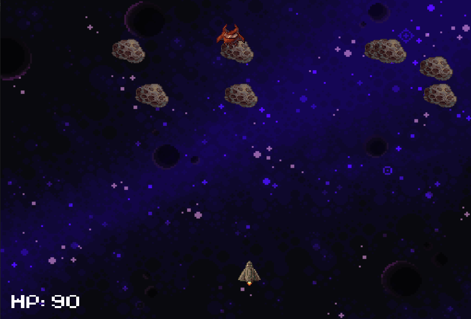

# Star Buster
Star Buster is singleplayer game inspired by space shooter games.

## How to Use
The program is safe to run but may occur a warning due the fact the program is not widely known.
Find Star Buster.exe within \x64-release\ folder or \Star Buster\ folder.
(Program is only compatible with Windows 10-11)

## Dependencies

Simple DirectMedia Layer(SDL) is used for this project to happen.

## License

This project is licensed under the [MIT License].

## Contributions

Contributions to the project are welcome. Feel free to submit bug reports, feature requests, or pull requests on the project's GitHub repository.

## Authors

- https://github.com/Ghostnooob123
- https://www.linkedin.com/in/ivo-rahnev-382778264/
